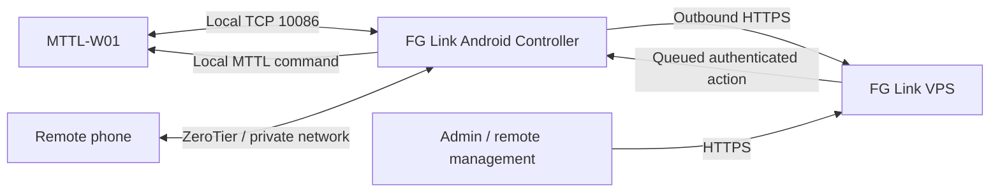

# FG Link

> **Local-first smart power control, remote access, diagnostics, automation and device management for MTTL-W01.**  
> Official FG Machines distribution repository.

[](#download)
[](#download)
[](#download)
[](https://fgmachines.org)
[](#vps-status)

## العربية

**FG Link** منصة Android لإدارة مشتركات الطاقة الذكية المتوافقة مع **MTTL-W01**. صُمم النظام بمنهج **Local-First**: الوظائف الأساسية تعمل داخل الشبكة المحلية، ثم يمكن إضافة التحكم البعيد عبر **ZeroTier** أو عبر **FG Link VPS Relay** بدون تحويل الخادم إلى نقطة اعتماد وحيدة.

هذا المستودع هو **الصفحة الرسمية للتوزيع والتوثيق**. كود Android الهندسي، مفاتيح التوقيع، ملفات R8 mapping وأسرار البناء غير منشورة هنا.

## Download

### FG Link 1.6.14 — Build 43

- **APK الرسمي الموقّع:** يجري نشر ملف 1.6.14 إلى قسم Releases. النسخة العامة الموجودة حاليًا في المستودع: [1.6.13](releases/1.6.13/FG-Link-1.6.13-Hardened-Signed.apk)
- **الكتاب العربي المصوّر:** سيتم وضعه في `docs/FG-Link-User-Guide-AR-Illustrated-v1.6.14.pdf`
- **Package:** `com.fgmachines.rck`
- **APK 1.6.14 SHA-256:** `9b7c38657835d2f323f789494d36b57b0f12757964a1c20a3f69af91b682ee94`
- **Signing certificate SHA-256:** `b9ca4a23be53f161a47b5aaf97023d2bbbeebdaf671337d2466fb74cc1f29fdf`

> نزّل النسخة فقط من صفحة FG Machines الرسمية، وراجع الـSHA-256 والتوقيع قبل التثبيت.

## What FG Link does

| الوظيفة | الحالة |
|---|---|
| Router / LAN mode | ✅ Stable |
| One-phone mode | ✅ Available — depends on phone hotspot/Wi-Fi behavior |
| Two-phone mode | ✅ Recommended when no router is available |
| Multiple MTTL-W01 strips | ✅ |
| Outlet control + live state | ✅ |
| Power / energy / temperature telemetry | ✅ |
| Scenes, automation and history | ✅ |
| ZeroTier remote access | ✅ |
| FG Link VPS relay | ✅ |
| VPS admin control through controller phone | ✅ |
| **VPS Direct: strip → VPS without controller phone** | 🧪 Testing / not public |
| In-app VPS self-registration | 🧪 Prepared / disabled during testing |
| IR remote control | ✅ **Only when the Android device has an IR Blaster** |
| Arabic RTL + English and additional languages | ✅ |

## Architecture



### Why Local-First?

لو الإنترنت أو الـVPS توقف، التحكم المحلي لا يتحول إلى وظيفة معطلة. ZeroTier يظل مسارًا مستقلًا للتحكم البعيد، والـVPS يعمل كطبقة إضافية للإدارة والمزامنة.

## VPS status

**FG Link VPS Relay** يعمل حاليًا بالطريقة التالية:

```
Remote/Admin → HTTPS VPS → Android Controller → MTTL-W01
```

يعني ظهور المشترك Online على السيرفر يسمح بإرسال أوامر من لوحة الخادم طالما **هاتف الـController داخل الموقع شغال ومتصل بالمشترك والإنترنت**.

أما المسار:

```
MTTL-W01 → Internet → VPS:10086
```

فهو **VPS Direct**، وموجود كمسار اختباري فقط حاليًا. لا يتم تقديمه للمستخدمين كميزة عامة قبل اكتمال اختبارات الأجهزة والأمان والاستقرار.

## Three setup modes

### 1. Router Mode
الهاتف والمشترك على نفس شبكة Wi-Fi ‏2.4GHz، والهاتف يعمل كـController.

### 2. One-Phone Mode
نفس الهاتف يستخدم Hotspot ويعمل كـController. متاح، لكن سلوكه يعتمد على دعم الهاتف للتبديل بين Hotspot وشبكة الإعداد.

### 3. Two-Phone Mode
الهاتف الأول: Hotspot + Controller.  
الهاتف الثاني: يستخدم فقط لتوصيل المشترك بـTONLY_TAP وكتابة بيانات الهاتف الأول.  
هذا هو الوضع الموصى به عند عدم وجود راوتر ثابت.

## ZeroTier remote access

ZeroTier يوفّر شبكة خاصة بين هاتف الـController والهاتف البعيد بدون Port Forwarding عام. الدليل يشرح إنشاء Network، نسخ Network ID، Join، Authorize، الربط داخل FG Link وتشخيص الأعطال.

## IR Remote

FG Link يحتوي على وظائف ريموت للأجهزة المتوافقة. **إرسال أوامر الأشعة تحت الحمراء يتطلب هاتف Android مزودًا فعليًا بـIR Blaster.** وجود التطبيق وحده لا يضيف IR لهاتف لا يحتوي على الهاردوير.

## Engineering & security

الإصدار العام مبني كـ**hardened signed release**:

- R8 full-mode optimization/minification.
- Resource shrinking.
- App implementation classes are repackaged/obfuscated.
- Release build is non-debuggable.
- Android log calls are stripped from optimized release bytecode.
- R8 mapping files remain private.
- Signing keys and CI secrets are never committed.
- Wi-Fi passwords, ZeroTier secrets and local MTTL control material are not stored on the VPS.
- Public downloads include SHA-256 and signing-certificate identity.

الحماية ترفع تكلفة الهندسة العكسية ولا تجعلها مستحيلة. المرجع الحقيقي للنسخة الرسمية هو توقيع FG Machines + الـhash + سجل النشر.

Read: [Authenticity & verification](docs/AUTHENTICITY.md) • [Security policy](SECURITY.md)

## Documentation

- 📖 [دليل الاستخدام العربي — Markdown](docs/USER-GUIDE-AR.md)
- 🧩 [Server architecture — Arabic](docs/SERVER-ARCHITECTURE-AR.md)
- 🔐 [Authenticity & verification](docs/AUTHENTICITY.md)

## Official FG Machines links

- Website: https://fgmachines.org
- FG Link VPS: https://link.fgmachines.org
- Facebook page: https://www.facebook.com/share/1T7r3WpH8Y/
- Developer profile: https://www.facebook.com/share/1EKVAyZZ2C/
- Email: info@fgmachines.org
- GitHub: https://github.com/FGMachines/FG-Hub

تابع الصفحة والحساب الرسميين؛ سيتم نشر **برمجيات وأدوات ومشاريع FG Machines أخرى** تباعًا.

---

**Publisher:** FG Machines  
**Android package:** `com.fgmachines.rck`  
**Current engineering build:** `1.6.14 / build 43`
