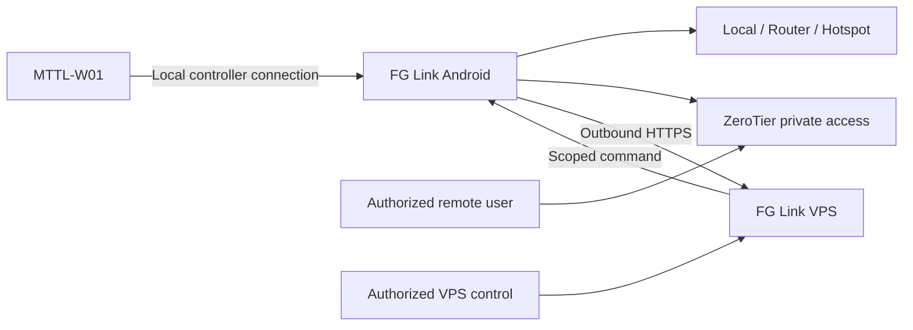

<div align="center">

# FG Link

### Local-first Android control platform by **FG Machines**

**Router • Hotspot • ZeroTier • VPS Relay • Energy Monitoring • Automation • IR Remote**

[](#)
[](releases/1.6.15/)
[](releases/1.6.15/RELEASE-INFO.md)
[](https://fgmachines.org)

**[⬇️ تحميل FG Link 1.6.15 APK](releases/1.6.15/FG-Link-1.6.15-Hardened-Signed.apk)**  
**[📘 تحميل الدليل العربي المصوّر](docs/FG-Link-User-Guide-AR-Illustrated.pdf)**

</div>

---

## ما هو FG Link؟

**FG Link** مشروع Android للتحكم في مشتركات الطاقة المدعومة وإدارتها محليًا وعن بُعد، مع فلسفة واضحة: **Local-First**.

هذا يعني أن النظام لا يجعل الـCloud شرطًا لكي تعمل الشبكة الأساسية. يستطيع المستخدم تشغيل النظام عبر الراوتر أو نقطة اتصال الهاتف، واستخدام **ZeroTier** للتحكم البعيد الخاص، مع وجود **FG Link VPS** كطبقة اختيارية للإدارة والمزامنة.

الإصدار الحالي العام: **1.6.15 - Build 44**.

> **VPS Direct ما زال في مرحلة الاختبار والفحص.**  
> لا يتم تقديمه للمستخدمين على أنه بديل عن Router / LAN / ZeroTier. المسارات الحالية تظل مستقلة ومتاحة.

---

## لماذا المشروع مختلف؟

FG Link ليس مجرد شاشة بها أزرار تشغيل وإيقاف. المشروع مبني حول فصل واضح بين **طبقة الجهاز، طبقة التحكم المحلي، الوصول البعيد، الهوية، القياس، الأتمتة والتشخيص**.

| المجال | ما يقدمه FG Link |
|---|---|
| Local Control | تحكم محلي بدون اعتماد إجباري على Cloud |
| Setup Modes | Router / هاتف واحد / هاتفين |
| Remote Access | ZeroTier + VPS Relay |
| Device Fleet | إدارة أكثر من مشترك واختيار الجهاز النشط |
| Power Data | قدرة، طاقة، حرارة وحالة المخارج حسب البيانات التي يعلنها الجهاز |
| Automation | مؤقتات، حدود، جداول، مشاهد وأوضاع تشغيل |
| Diagnostics | فحص الاتصال والشبكة وحالة الجهاز |
| IR Remote | تحكم بالأجهزة المتوافقة عندما يحتوي الهاتف على **IR Blaster** |
| Security | APK موقّع + R8 + Resource Shrinking + Release Integrity Check |
| Documentation | دليل عربي تفصيلي ومصوّر |

---

## أوضاع التشغيل

### 1. Router Mode

الهاتف والمشترك يعملان على شبكة Wi-Fi ‏2.4 GHz واحدة. هذا هو المسار الأكثر ثباتًا للاستخدام الدائم.

### 2. One-Phone Mode

يمكن للهاتف نفسه أن يكون Hotspot ووحدة التحكم. نجاح هذا الوضع يعتمد جزئيًا على طريقة إدارة Android والشركة المصنعة لاتصالات Wi-Fi/Hotspot.

### 3. Two-Phone Mode

هاتف أساسي يبقى Controller/Hotspot، وهاتف ثانٍ يستخدم أثناء إعداد شبكة المشترك. مناسب للمواقع التي لا يوجد بها راوتر.

### 4. ZeroTier

مسار خاص للتحكم البعيد بدون نشر منافذ التحكم المحلية مباشرة على الإنترنت العام.

### 5. FG Link VPS Relay

المسار الحالي يسمح للهاتف المحلي بإرسال حالة المشترك إلى VPS واستلام أوامر محددة عبر HTTPS ثم تنفيذها محليًا.

---

## Architecture



التصميم الحالي يجعل الهاتف المحلي طبقة التنفيذ الفعلية لمسار VPS Relay، ويمنع تحويل وجود الخادم إلى شرط لازم للتحكم المحلي.

للتفاصيل: **[النظرة التقنية العربية](docs/TECHNICAL-OVERVIEW-AR.md)**.

---

## VPS Direct - Testing

المرحلة الاختبارية التالية تبحث إمكانية:

```text
MTTL-W01 -> Internet -> FG Link VPS
```

بحيث لا يحتاج الجهاز إلى هاتف Controller في المسار المباشر.

لكن هذا الوضع **ليس مفعّلًا للعامة حاليًا**. يتم اختباره منفصلًا قبل أي طرح عام، بينما تظل الطرق الحالية كما هي.

---

## IR Remote

FG Link يحتوي على قسم Remote للأجهزة التي تعمل بالأشعة تحت الحمراء.

**مهم:** الهاتف الذي سيرسل أوامر الريموت يجب أن يحتوي فعليًا على **IR Blaster / Consumer IR**. البرنامج لا يستطيع إضافة مرسل IR إلى جهاز لا يحتوي على العتاد.

---

## الإصدار الرسمي 1.6.15

- Package ID: `com.fgmachines.rck`
- Version: **1.6.15**
- Version Code: **44**
- Publisher: **FG Machines**
- APK SHA-256:

```text
90ab5e8c85847f3b65444f2eeae349c78fcc182625e6be6cb14c0c3066568903
```

Official signing certificate SHA-256:

```text
b9ca4a23be53f161a47b5aaf97023d2bbbeebdaf671337d2466fb74cc1f29fdf
```

**[Download APK](releases/1.6.15/FG-Link-1.6.15-Hardened-Signed.apk)**  
**[Release verification files](releases/1.6.15/)**

---

## صعوبة إعادة التغليف والتقليد

لا يوجد APK يمكن وصفه بأنه مستحيل الهندسة العكسية. لذلك يستخدم FG Link دفاعًا متعدد الطبقات بدل الادعاءات غير الواقعية:

- R8 full-mode optimization/minification.
- إعادة تسمية وتجميع implementation classes في الإصدار العام.
- Resource shrinking.
- إزالة Android debug log calls من release bytecode.
- عدم نشر R8 mapping files.
- عدم نشر signing keys أو build secrets.
- إخفاء بعض operational wire constants من النص الواضح داخل APK.
- التحقق داخل الإصدار العام من **Package ID + شهادة توقيع FG Machines**.
- نشر SHA-256 وشهادة التوقيع مع كل إصدار.

هذه الإجراءات ترفع تكلفة النسخ وإعادة التوقيع، بينما تجعل النسخة الأصلية سهلة التحقق للمستخدم.

راجع: **[Security Policy](SECURITY.md)** و **[Release Provenance](PROVENANCE.md)**.

---

## الدليل العربي المصوّر

الدليل يشمل أكثر من 30 صفحة ويغطي:

- إعداد المشترك من البداية.
- Router Mode.
- One-Phone Mode.
- Two-Phone Mode.
- ZeroTier: إنشاء الحساب، Network ID، Authorize والربط.
- التحكم المحلي والبعيد.
- شرح المصطلحات الإنجليزية والعربية.
- تشخيص الأعطال.
- IR Remote.
- حالة VPS الحالية كميزة تحت الاختبار.
- استعادة بيانات الإعداد بالطريقة الآمنة وإعادة التهيئة عند الحاجة.

**[📘 فتح الدليل المصوّر PDF](docs/FG-Link-User-Guide-AR-Illustrated.pdf)**

---

## Release authenticity / إثبات النسخة الرسمية

هذه الصفحة ليست مستودع source عام؛ هي **Official Distribution Repository**.

الهدف أن يستطيع أي شخص التأكد أن الملف الذي معه هو نفس الملف الذي نشرته FG Machines عن طريق:

1. سجل Git العام وتاريخ النشر.
2. SHA-256.
3. شهادة توقيع Android.
4. Package ID والإصدار.
5. ملفات Release Info المنشورة مع الـAPK.

تفاصيل الملكية والتوزيع: **[COPYRIGHT.md](COPYRIGHT.md)**.

---

## روابط FG Machines الرسمية

- Website: **https://fgmachines.org**
- FG Link VPS: **https://link.fgmachines.org**
- GitHub: **https://github.com/FGMachines/FG-Hub**

> تابع حسابات وصفحات FG Machines الرسمية لأن الإصدارات الجديدة والأدلة والمشروعات والبرمجيات القادمة ستُنشر من خلالها.

---

<div align="center">

### FG Machines
**Software • Tools • Automation • Connected Devices**

FG Link 1.6.15 • Signed Android Release • 2026

</div>
