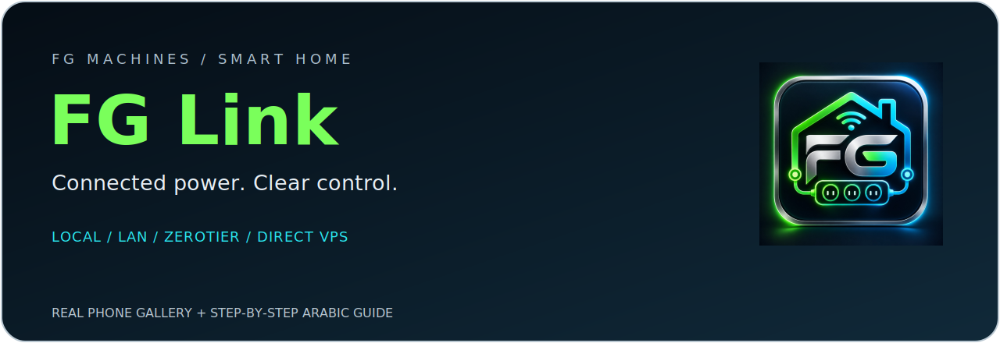
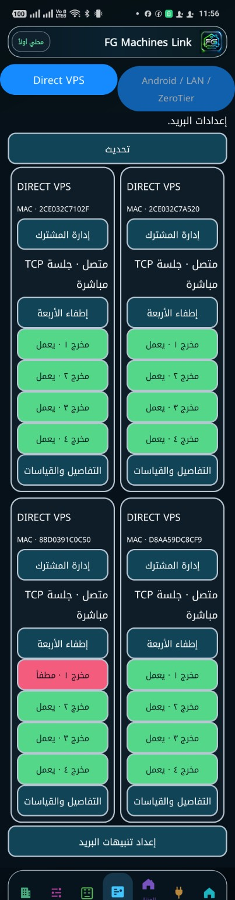
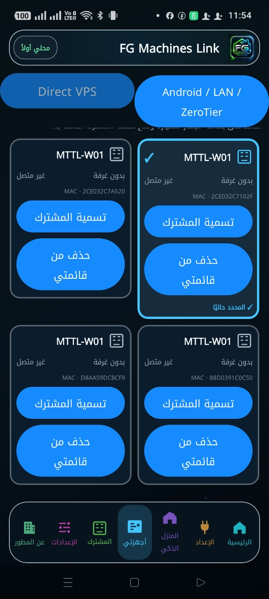
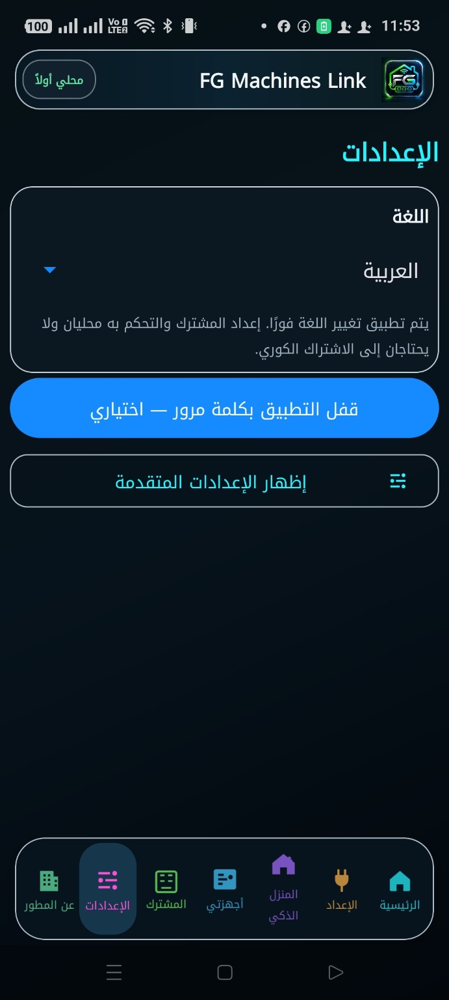
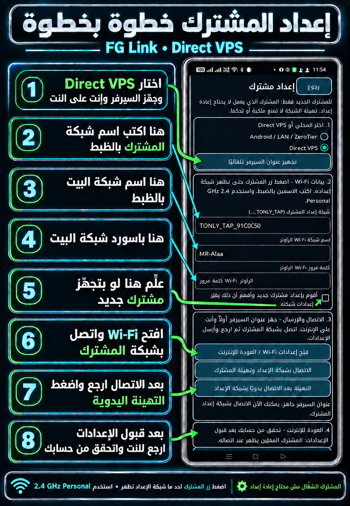
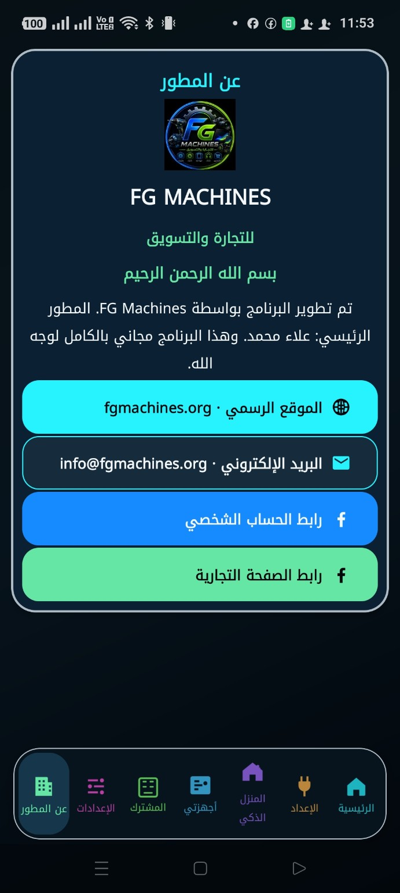

<h1>بيتك متصل. والتحكم قدّامك.</h1>

مع <strong>FG Link</strong> تابع مشتركات الطاقة الذكية، وشغّل المخارج المسموح لك بها، واختار طريقة الاتصال المناسبة: المحلي، LAN، ZeroTier أو Direct VPS. كل ده في واجهة عربية واضحة من FG Machines.

<strong>أجهزة MTTL-W01 · حساب شخصي في VPS · شبكة بطاقات · قفل اختياري</strong>

## من هاتفك، للشرح مباشرة

جولة داخل **FG Link 2.1.5**. بتعرض الواجهة الفعلية: أربع مشتركات في Direct VPS، والقائمة المحلية، والإعدادات، وصفحة المطور.

## إعداد المشترك — بصّ على الأسهم

**[افتح الصورة المشروحة بالحجم الكامل](docs/images/2.1.5/setup-annotated.png)**

**[اقرأ دليل الإعداد وحل المشكلات](docs/USER-GUIDE-AR-2.1.5.md)** — فيه الخطوات، ومعنى كل زر، والتشخيص، وحل المشكلات الشائعة.

> **المشترك اللي شغّال بالفعل مش محتاج إعداد من جديد.** المعالج يغيّر بيانات شبكة الجهاز؛ تهيئة Wi-Fi لا تمنح ملكية أو صلاحية تحكم.

## اللي هتلاقيه جوّه البرنامج

| الميزة | استخدامها |
|---|---|
| بطاقات بجوار بعض | المشتركات في شبكة بعمودين عندما تسمح الشاشة، مع تكيفها مع الخط الكبير |
| حالة كل مخرج | الأخضر يعمل، والقرمزي مطفأ، والحالات غير المعروفة لا تُعرض كنجاح |
| إطفاء الأربعة | إطفاء المخارج المسموح بها بالتتابع وعرض نتيجة كل مخرج |
| إدارة المشترك | التسمية، وإزالة البطاقة من هذا الهاتف واستعادتها، والتحكم الصوتي وفق الصلاحيات |
| إعداد مرقّم وتشخيص عربي | خطوات واضحة ورسالة تشرح المشاكل التي يمكن للتطبيق فحصها |
| قفل اختياري | تقدر تفعّله أو تتخطّاه؛ لا يستبدل تسجيل دخول حساب VPS |
| تصوير الشاشة | صور أو سجّل شرح الاستخدام، مع بقاء كلمات المرور مقنّعة |
| الريموت | مستمر داخل FG Link، وله أيضًا [تطبيق مستقل](https://github.com/FGMachines/FG-Remote) |

## اختار طريق الاتصال المناسب

**Local / LAN:** المسار المحلي وController الحالي. **ZeroTier:** امتداد لمسارك الحالي من خلال الشبكة الخاصة وإعدادها واعتمادها. **Direct VPS:** المشترك يتصل بالخادم عبر الإنترنت، والهاتف يستخدم حسابك الشخصي للتحكم.

**يعني إيه عمليًا؟** لو شغّال عندك المحلي أو ZeroTier، وجود VPS مش بيلغيهم. وفي Direct VPS الهاتف مش هو Controller. الأجهزة تظهر بعد اتصالها وتعيينها للحساب من لوحة الإدارة المحمية؛ معرفة MAC أو إعداد الشبكة لا يمنحان التحكم.

## المشاهدة والتحكم والحذف

- المستخدم يشاهد ويتحكم وفق صلاحيات الحساب وسياسة كل مخرج. حساب المشاهدة لا يرسل أوامر، بما فيها الصوت والإطفاء الجماعي.
- «إطفاء الأربعة» لا يتجاوز الصلاحيات. لو مخرج فشل أو حصل timeout، راجع نتيجة كل مخرج؛ الإرسال وحده مش تأكيد.
- الحذف داخل هذه النسخة **إزالة من قائمة الهاتف** مع الاستعادة؛ لا يفك ربط الحساب بالخادم، ولا يعيد ضبط الجهاز، ولا يحذف أجهزة مستخدم آخر.
- نسخة العملاء تستخدم الحساب الشخصي. إدارة المستخدمين والتعيين والصلاحيات في لوحة الويب المحمية، دون دخول مالك داخل التطبيق العام.

## محتاج مساعدة؟ اسأل في الجروب

**[مجتمع FG Machines — الأسئلة والحلول](https://www.facebook.com/share/g/19J8NVxQX8/)**

قول لنا إصدار التطبيق، وموديل الهاتف والمشترك، وطريقة الاتصال، ونص رسالة التشخيص. ابعت لقطة واضحة للرسالة؛ **ما تبعتش باسورد الشبكة أو الحساب**.

## التحميل والتحديث

**[صفحة ملفات APK المنشورة](https://github.com/FGMachines/FG-Hub/releases/latest)** · [التحقق من التوقيع](docs/AUTHENTICITY.md)

**النسخة الجديدة: 2.1.5 — رقم البناء 50.** جارٍ تحديث صفحة التنزيل؛ ملف GitHub المنشور حاليًا هو 2.1.2. لو نسختك أحدث، انتظر ملف 2.1.5 ولا تثبّت إصدارًا أقدم.

للتحديث الرسمي: ثبّت النسخة الأحدث فوق الحالية بنفس الحزمة والتوقيع. **ما تحذفش التطبيق وما تمسحش بياناته لمجرد التحديث.** اسم الحزمة `com.fgmachines.rck`، وشهادة التوقيع الأصلية موثقة في دليل الأصالة.

## الأدلة والمراجع

- **[الدليل الجديد بالأسهم — 2.1.5](docs/USER-GUIDE-AR-2.1.5.md)**.
- [دليل الإصدار السابق 2.1.2](docs/USER-GUIDE-AR.md) · [تغييرات 2.1.2](releases/2.1.2/RELEASE_NOTES.md).
- [سجل النشر والأصالة](PROVENANCE.md) · [الأمان](SECURITY.md).
- [إصدار 1.6.14 المؤرشف](https://github.com/FGMachines/FG-Hub/releases/tag/v1.6.14) · [دليله القديم](docs/archive/USER-GUIDE-AR-1.6.14.md).

هذا مستودع التوزيع والشرح العام. المصدر البرمجي للتطبيق والخادم ومفاتيح التوقيع وكلمات المرور ليست منشورة هنا.

---

<strong>FG MACHINES</strong> <a href="https://fgmachines.org">الموقع الرسمي</a> · <a href="mailto:info@fgmachines.org">البريد</a> · <a href="https://www.facebook.com/share/1T7r3WpH8Y/">الصفحة التجارية</a> · <a href="https://www.facebook.com/share/1EKVAyZZ2C/">صفحة المطور</a> · <a href="https://www.facebook.com/share/g/19J8NVxQX8/">جروب الدعم</a>

