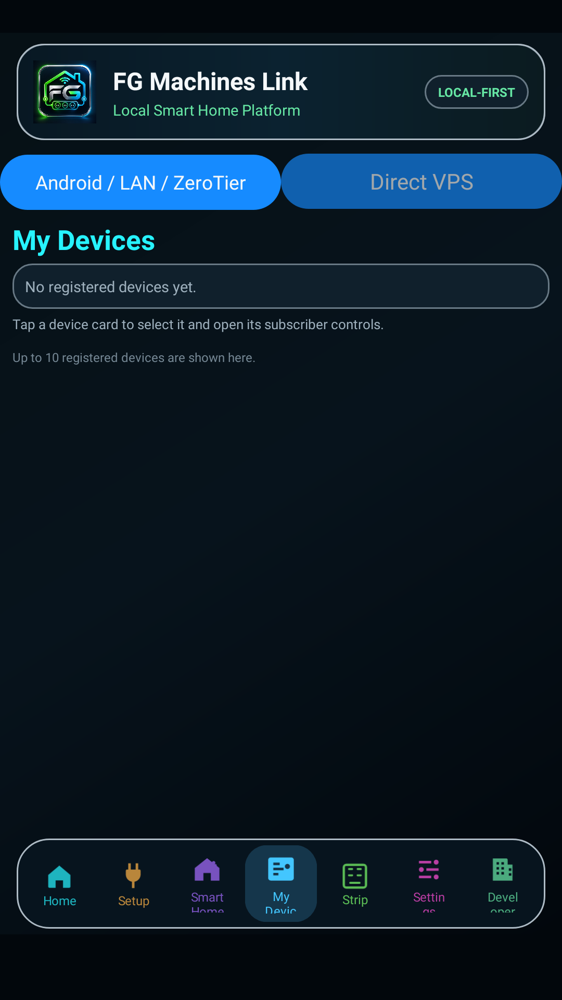
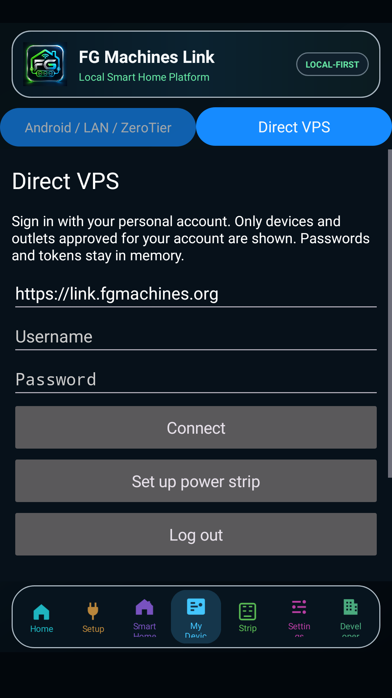
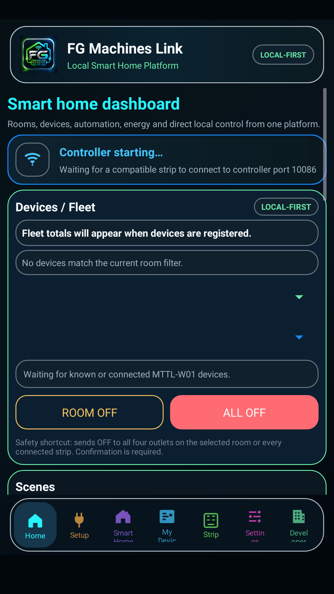
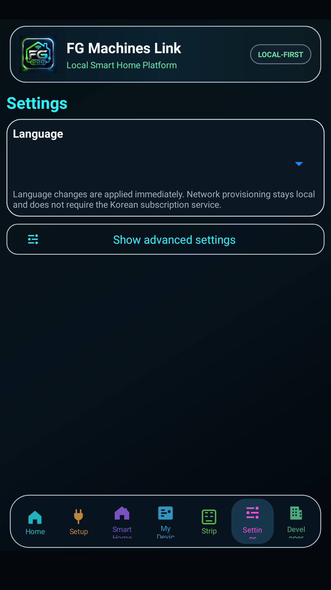

# FG Link 2.1.2

**منصة FG Machines للتحكم في مشتركات الطاقة الذكية MTTL-W01، محليًا أو عبر Direct VPS، مع التنبيهات وإدارة الأجهزة والريموت.**

## حمّل الإصدار الحالي

### [⬇ تحميل FG Link 2.1.2 — APK الرسمي الموقّع](https://github.com/FGMachines/FG-Hub/releases/download/v2.1.2/FG-Link-2.1.2-v47.apk)

**[صفحة الإصدار](https://github.com/FGMachines/FG-Hub/releases/tag/v2.1.2) · [الدليل العربي المصوّر الجديد](docs/USER-GUIDE-AR.md) · [تفاصيل التغييرات](releases/2.1.2/RELEASE_NOTES.md) · [التحقق من التوقيع](docs/AUTHENTICITY.md)**

النسخة الحالية **2.1.2 / Build 47**. تُثبَّت كتحديث فوق النسخة الرسمية ذات رقم البناء الأقل، بنفس اسم الحزمة والتوقيع. احتفظ ببيانات التطبيق؛ المشتركات التي تعمل بالفعل لا تحتاج إعادة تهيئة.

هذا المستودع العام مخصّص للتوزيع والتوثيق. **المصدر البرمجي للتطبيق والخادم ومفاتيح التوقيع وكلمات المرور غير منشورة هنا.**

## ما الجديد في 2.1.2؟

| التغيير | النتيجة للمستخدم |
|---|---|
| Direct VPS داخل «أجهزتي» | الاختيار بين LAN / ZeroTier وDirect VPS من الصفحة نفسها، مع استمرار التنقل بين بقية أقسام التطبيق |
| حساب المستخدم الشخصي | عرض الأجهزة والمخارج المعتمدة للحساب فقط؛ إدارة المالك تبقى في لوحة الويب المحمية |
| «إعداد مشترك» | معالج للمشترك الجديد يدعم المحلي وDirect VPS، ويجهّز عنوان الخادم تلقائيًا في مسار Direct |
| تنبيهات البريد | إعداد المستلم والتفعيل وحدود الحمل والحرارة، مع حفظ وإرسال رسالة اختبار من الحساب الشخصي |
| فصل الإعداد عن الصلاحيات | إعداد Wi-Fi أو معرفة MAC لا يمنحان ملكية الجهاز أو حق التحكم |
| الحفاظ على الميزات السابقة | LAN وZeroTier والريموت داخل FG Link، مع استمرار بيانات التطبيق والإعدادات الحالية |

## الواجهة الجديدة بالصور

الصور التالية لقطات فعلية من واجهة 2.1.2 أثناء اختبار التنقل باللغة الإنجليزية. حساب الاختبار غير مسجّل الدخول ولا توجد مشتركات متصلة؛ الصور توضّح الواجهة ولا تدّعي اتصالًا بجهاز فعلي.

<table>
<tr><th>أجهزتي: المسار المحلي</th><th>أجهزتي: Direct VPS</th></tr>
<tr><td></td><td></td></tr>
</table>

**كيف تستخدمها؟** افتح «أجهزتي»، ثم اختر **Android / LAN / ZeroTier** أو **Direct VPS**. عند اختيار Direct، سجّل الدخول بحسابك الشخصي. استخدم الشريط السفلي لفتح المنزل أو الإعدادات أو بقية الأقسام، ثم ارجع إلى أجهزتي؛ لا يلزم تسجيل الخروج لمجرد التنقل.

<table>
<tr><th>لوحة المنزل</th><th>الإعدادات</th></tr>
<tr><td></td><td></td></tr>
</table>

**[اقرأ الشرح المصوّر خطوة بخطوة](docs/USER-GUIDE-AR.md)** للإعداد، تسجيل الدخول، البريد، الصلاحيات، ZeroTier وتشخيص الأجهزة غير المتصلة.

## إعداد مشترك جديد

1. اضغط «إعداد مشترك» واختر المحلي أو Direct VPS.
2. في المحلي احتفظ بعنوان Controller الحالي. في Direct جهّز عنوان السيرفر تلقائيًا وأنت متصل بالإنترنت.
3. أدخل بيانات Wi-Fi الراوتر، ثم اتصل مؤقتًا بشبكة إعداد المشترك TONLY_TAP / ONLY_TAP لتنفيذ التهيئة.
4. عد إلى شبكة الراوتر أو الإنترنت وتحقق من النتيجة الفعلية.
5. في Direct يظهر الجهاز بعد اتصاله بالخادم إذا كان معيّنًا لحسابك. إذا لم يكن معيّنًا، اطلب اعتماده وربطه بحسابك من الإدارة.

**استلام إعدادات الشبكة لا يعني اتصال الجهاز بالخادم أو منحه صلاحية التحكم.** ولا تعد تهيئة مشترك يعمل بالفعل.

## تنبيهات البريد

سجّل الدخول إلى Direct VPS بحسابك الشخصي، ثم افتح «إعداد تنبيهات البريد». أدخل بريد الاستلام وحدود الحمل والحرارة، فعّل التنبيهات واضغط «حفظ وإرسال اختبار».

يشمل التنبيه الانقطاع المستمر بعد دقيقتين والحماية والحمل والحرارة للأجهزة والمخارج المسموح لك بمشاهدتها. تعمل التنبيهات من الخادم عند إغلاق التطبيق، **بشرط تحديث خدمة الخادم وتجهيز SMTP بواسطة الإدارة**. إذا كان SMTP غير مجهّز يظهر السبب؛ تشغيل الزر وحده لا يجهّز خدمة البريد. قبول خادم البريد رسالة الاختبار لا يضمن وصولها إلى صندوق الوارد؛ راجع البريد غير المرغوب فيه أيضًا.

## الصلاحيات والتحكم

- تطبيق العملاء يستخدم الحسابات الشخصية؛ لا يوجد مسار تسجيل دخول المالك في النسخة العامة.
- ربط MAC بالحساب واعتماد الأجهزة والصلاحيات يتم من لوحة الإدارة المحمية، ويُفرض في الخادم.
- حساب المشاهدة يعرض الحالات المسموح بها. التحكم والأوامر الصوتية يخضعان لصلاحيات الحساب وسياسة كل مخرج.
- الجهاز المعيّن للحساب يظهر بعد الاتصال الفعلي بالخادم. الجهاز غير المعيّن يحتاج اعتماد الإدارة؛ الجهاز المعيّن غير المتصل يحتاج فحص الشبكة.

## LAN وZeroTier والريموت

**LAN:** الهاتف والمشترك يعملان ضمن الشبكة المحلية مع Controller الحالي. **ZeroTier:** استخدم إعداد الشبكة الخاصة والاعتماد الحاليين لمسار التحكم البعيد. Direct VPS مسار إضافي للأجهزة المجهّزة والمتصلة بالخادم والمعتمدة للحساب.

الريموت **موجود داخل FG Link**، وله أيضًا تطبيق مستقل: **[FG Remote](https://github.com/FGMachines/FG-Remote/releases/tag/v1.0.0)**. إرسال الأشعة تحت الحمراء يتطلب هاتفًا مزوّدًا بمرسل IR وجهازًا متوافقًا.

## التثبيت والتحديث

1. نزّل APK الرسمي من الرابط أعلاه.
2. وافق على التثبيت من المصدر الذي استخدمته عند طلب Android.
3. اختر التحديث فوق FG Link الحالي. **لا تحذف التطبيق أو تمسح بياناته** لإجراء التحديث.
4. افتح «أجهزتي» واختبر المسار الذي تستخدمه. تحتاج بيانات حساب شخصي عند استخدام Direct VPS؛ المحلي لا يحتاج حساب Direct.

| هوية النسخة | القيمة |
|---|---|
| Version | 2.1.2 |
| versionCode | 47 |
| Package | `com.fgmachines.rck` |
| APK | `FG-Link-2.1.2-v47.apk` |
| SHA-256 | `07c9307f9657b02c6893174a37f2a60701b0afae4c30985877599cc5abfeff0f` |
| شهادة التوقيع SHA-256 | `b9ca4a23be53f161a47b5aaf97023d2bbbeebdaf671337d2466fb74cc1f29fdf` |

## الأدلة والإصدارات السابقة

- **[دليل 2.1.2 العربي المصوّر](docs/USER-GUIDE-AR.md)** — المرجع الحالي للواجهة الجديدة.
- [سجل النشر والأصالة](PROVENANCE.md) · [التحقق من التوقيع](docs/AUTHENTICITY.md) · [الأمان](SECURITY.md).
- [إصدار 1.6.14 المؤرشف](https://github.com/FGMachines/FG-Hub/releases/tag/v1.6.14) · [دليله القديم](docs/archive/USER-GUIDE-AR-1.6.14.md) · [كتابه المصوّر PDF](https://github.com/FGMachines/FG-Hub/releases/download/v1.6.14/FG-Link-User-Guide-AR-Illustrated-v1.6.14.pdf). يشرح ذلك الدليل الواجهة السابقة ولا يُستخدم لتفسير Direct VPS في 2.1.2.

## FG Machines

[الموقع الرسمي](https://fgmachines.org) · [صفحة Facebook](https://www.facebook.com/share/1T7r3WpH8Y/) · [صفحة المطور](https://www.facebook.com/share/1EKVAyZZ2C/) · [info@fgmachines.org](mailto:info@fgmachines.org)

**English:** FG Link 2.1.2 (build 47) is the current signed Android release. Direct VPS is integrated into My Devices alongside LAN / ZeroTier, uses personal accounts and server-enforced permissions, and includes power-strip setup and email alert settings. Email delivery requires server SMTP configuration. This public repository contains distribution files and documentation; application and server source code remain private.
