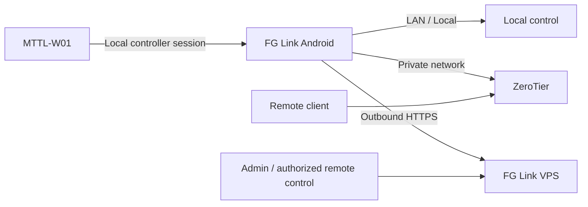

# FG Link - نظرة تقنية احترافية

> **FG Link** منصة Android للتحكم المحلي والبعيد في مشتركات الطاقة المدعومة، مع تصميم Local-First يحافظ على عمل الشبكة المحلية حتى لو لم تتوفر خدمة VPS.

## ما المشكلة التي يحلها المشروع؟

بدل الاعتماد الكامل على Cloud مغلق، FG Link يجعل الهاتف جزءًا واضحًا من بنية التحكم ويقسم الاتصال إلى مسارات مستقلة:

- تحكم محلي عبر الراوتر أو نقطة اتصال الهاتف.
- وضع هاتف واحد.
- وضع هاتفين.
- تحكم بعيد خاص عبر ZeroTier.
- مزامنة اختيارية مع FG Link VPS.
- VPS Direct كتجربة منفصلة قيد الفحص، وليس بديلًا إجباريًا عن المسارات الحالية.

## البنية الحالية



### المبدأ الأساسي

الهاتف المحلي هو طبقة التنفيذ الفعلية في مسار VPS Relay الحالي. الخادم يستقبل حالة الأجهزة ويضع أوامر محددة، ثم التطبيق المحلي ينفذها على المشترك ويرجع النتيجة.

## أوضاع الإعداد

| الوضع | الاستخدام | ملاحظات |
|---|---|---|
| Router Mode | شبكة منزل/مكتب ثابتة | الخيار الأكثر ثباتًا |
| One-Phone Mode | لا يوجد راوتر أو هاتف ثانٍ | يعتمد على إمكانيات الهاتف وإدارة Hotspot/Wi-Fi |
| Two-Phone Mode | لا يوجد راوتر وتريد إعدادًا أكثر ثباتًا | هاتف Controller + هاتف Setup |
| ZeroTier | تحكم بعيد بدون فتح منافذ عامة | المسار البعيد المجاني الحالي |
| VPS Relay | إدارة ومزامنة عن بعد عبر HTTPS | يعمل كمكمل للمسار المحلي |
| VPS Direct | اتصال المشترك بالخادم مباشرة | **قيد الاختبار والفحص** |

## التحكم عن بعد

### ZeroTier

ZeroTier لا يستبدل بروتوكول التحكم المحلي؛ هو يوفّر شبكة خاصة بين الطرفين. هذا يسمح بالوصول إلى واجهة FG Link المحلية من خارج الموقع بدون Port Forwarding عام.

### VPS Relay

في المسار الحالي:

```text
Remote / Admin
      |
      v
FG Link VPS
      |
      | HTTPS command queue
      v
Controller Phone
      |
      | Local device control
      v
MTTL-W01
```

### VPS Direct

VPS Direct هو مسار اختباري منفصل. الهدف منه اختبار:

```text
MTTL-W01 -> Internet -> FG Link VPS
```

ولا يتم تقديمه حاليًا على أنه المسار الافتراضي للمستخدمين. Router/LAN/ZeroTier تظل موجودة حتى بعد اكتمال اختبارات VPS Direct.

## الريموت بالأشعة تحت الحمراء

FG Link يتضمن وظائف Remote للأجهزة المتوافقة. **الهاتف المستخدم للإرسال الفعلي يجب أن يحتوي على IR Blaster / Consumer IR**. وجود واجهة الريموت في التطبيق لا يضيف مرسل أشعة تحت حمراء إلى هاتف لا يحتوي على العتاد المطلوب.

## الخصوصية

التصميم الحالي يتجنب رفع بيانات لا يحتاجها الخادم. على سبيل المثال، بيانات Wi-Fi وأسرار ZeroTier ومادة التحكم المحلية لا يجب أن تصبح أسرارًا مخزنة على VPS لمجرد أن المستخدم فعّل المزامنة.

## جودة الإصدار

كل إصدار عام يمر عبر:

- Unit tests.
- Android lint.
- Release build.
- R8 optimization/minification.
- Resource shrinking.
- APK signature verification.
- SHA-256 generation.
- التحقق من Package ID وVersion Code وVersion Name.

## حدود الحماية

لا يوجد APK مستحيل التفكيك. هدف FG Link هو **رفع تكلفة النسخ وإعادة التغليف** مع إبقاء الإصدار الرسمي قابلًا للتحقق بوضوح عبر التوقيع الرقمي والـSHA-256 وسجل Git العام.

للتشغيل العملي، راجع **الدليل العربي المصور** الموجود في مجلد `docs`.
